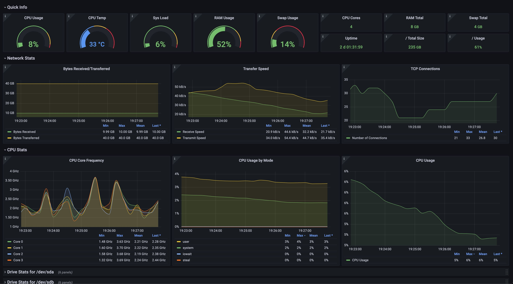
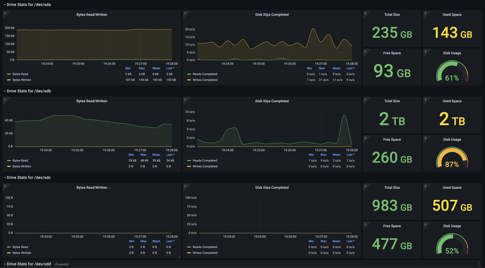

# Grafana

!!! warning
    You should set up [Prometheus](./prometheus.md) first before setting this up.

[Grafana](https://grafana.com/) is a dashboard that can consume from Prometheus and other data sources to display all the information that you need.

There is an official image for this service that we'll use: [grafana/grafana](https://hub.docker.com/r/grafana/grafana).

## Pre-Installation

We'll create a folder in the main user's home where all the service's data will be saved.

```bash
mkdir ~/services/observability/grafana
```

### External Network

Since this service needs to interoperate with another one, we'll need to have them inside the same network. Make sure to have created the `grafana_external` network before defining the `docker-compose.yml` file. If you haven't created this network, you can do so with:

```bash
docker network create grafana_external
```

## Docker Compose

*Grafana* will be run using *Docker Compose*. The content of the `docker-compose.yml` file is as follows:

```yaml
services:
  grafana:
    image: grafana/grafana:latest
    restart: unless-stopped
    user: 1000:1000
    networks:
      - default
      - grafana_external
    ports:
      - 24000:3000
    volumes:
      - ./data:/var/lib/grafana
    environment:
      TZ: America/Guayaquil

networks:
  grafana_external:
    external: true
```

## Running

Start up the service with:

```bash
docker compose up -d
```

That's it! The service will auto-start on system startup and restart on failure.

## Add Prometheus to Grafana

Visit the Grafana's site by accessing:

```text
http://localhost:3000
```

And create your Admin account.

Make your way to the following page:

```text
Configuration > Data Sources > Add a data source > Prometheus
```

And add the local IP of your server.

## Add a Dashboard

Make your way to the following page.

```text
Create > Import
```

And paste the following JSON in it:

```json
{
  "annotations": {
    "list": [
      {
        "builtIn": 1,
        "datasource": {
          "type": "grafana",
          "uid": "-- Grafana --"
        },
        "enable": true,
        "hide": true,
        "iconColor": "rgba(0, 211, 255, 1)",
        "name": "Annotations & Alerts",
        "target": {
          "limit": 100,
          "matchAny": false,
          "tags": [],
          "type": "dashboard"
        },
        "type": "dashboard"
      }
    ]
  },
  "description": "moonstar's Server Dashboard",
  "editable": true,
  "fiscalYearStartMonth": 0,
  "graphTooltip": 0,
  "id": 4,
  "iteration": 1653438285360,
  "links": [],
  "liveNow": false,
  "panels": [
    {
      "collapsed": false,
      "gridPos": {
        "h": 1,
        "w": 24,
        "x": 0,
        "y": 0
      },
      "id": 8,
      "panels": [],
      "title": "Quick Info",
      "type": "row"
    },
    {
      "datasource": {
        "type": "prometheus",
        "uid": "UCHnO3Wgz"
      },
      "description": "CPU Usage",
      "fieldConfig": {
        "defaults": {
          "color": {
            "mode": "thresholds"
          },
          "decimals": 0,
          "mappings": [],
          "max": 100,
          "min": 0,
          "noValue": "N/A",
          "thresholds": {
            "mode": "absolute",
            "steps": [
              {
                "color": "green",
                "value": null
              },
              {
                "color": "#EAB839",
                "value": 75
              },
              {
                "color": "semi-dark-red",
                "value": 95
              }
            ]
          },
          "unit": "percent"
        },
        "overrides": []
      },
      "gridPos": {
        "h": 4,
        "w": 3,
        "x": 0,
        "y": 1
      },
      "id": 2,
      "options": {
        "orientation": "horizontal",
        "reduceOptions": {
          "calcs": [
            "lastNotNull"
          ],
          "fields": "",
          "values": false
        },
        "showThresholdLabels": false,
        "showThresholdMarkers": true,
        "text": {}
      },
      "pluginVersion": "8.5.3",
      "targets": [
        {
          "datasource": {
            "type": "prometheus",
            "uid": "UCHnO3Wgz"
          },
          "editorMode": "code",
          "expr": "(((count(count(node_cpu_seconds_total{instance=\"$node\",job=\"$job\"}) by (cpu))) - avg(sum by (mode)(irate(node_cpu_seconds_total{mode='idle',instance=\"$node\",job=\"$job\"}[5m])))) * 100) / count(count(node_cpu_seconds_total{instance=\"$node\",job=\"$job\"}) by (cpu))",
          "hide": false,
          "range": true,
          "refId": "A"
        }
      ],
      "title": "CPU Usage",
      "type": "gauge"
    },
    {
      "datasource": {
        "type": "prometheus",
        "uid": "UCHnO3Wgz"
      },
      "description": "CPU temperature",
      "fieldConfig": {
        "defaults": {
          "color": {
            "mode": "thresholds"
          },
          "decimals": 0,
          "mappings": [],
          "max": 100,
          "min": 0,
          "noValue": "N/A",
          "thresholds": {
            "mode": "absolute",
            "steps": [
              {
                "color": "blue",
                "value": null
              },
              {
                "color": "#EAB839",
                "value": 45
              },
              {
                "color": "semi-dark-red",
                "value": 65
              }
            ]
          },
          "unit": "celsius"
        },
        "overrides": []
      },
      "gridPos": {
        "h": 4,
        "w": 3,
        "x": 3,
        "y": 1
      },
      "id": 5,
      "options": {
        "orientation": "horizontal",
        "reduceOptions": {
          "calcs": [
            "mean"
          ],
          "fields": "",
          "values": false
        },
        "showThresholdLabels": false,
        "showThresholdMarkers": true,
        "text": {}
      },
      "pluginVersion": "8.5.3",
      "targets": [
        {
          "datasource": {
            "type": "prometheus",
            "uid": "UCHnO3Wgz"
          },
          "editorMode": "code",
          "expr": "avg(node_hwmon_temp_celsius{instance=\"$node\",job=\"$job\"})",
          "hide": false,
          "range": true,
          "refId": "A"
        }
      ],
      "title": "CPU Temp",
      "type": "gauge"
    },
    {
      "datasource": {
        "type": "prometheus",
        "uid": "UCHnO3Wgz"
      },
      "description": "Sys Load (5m avg)",
      "fieldConfig": {
        "defaults": {
          "color": {
            "mode": "thresholds"
          },
          "decimals": 0,
          "mappings": [],
          "max": 100,
          "min": 0,
          "noValue": "N/A",
          "thresholds": {
            "mode": "absolute",
            "steps": [
              {
                "color": "green",
                "value": null
              },
              {
                "color": "#EAB839",
                "value": 75
              },
              {
                "color": "semi-dark-red",
                "value": 95
              }
            ]
          },
          "unit": "percent"
        },
        "overrides": []
      },
      "gridPos": {
        "h": 4,
        "w": 3,
        "x": 6,
        "y": 1
      },
      "id": 6,
      "options": {
        "orientation": "horizontal",
        "reduceOptions": {
          "calcs": [
            "lastNotNull"
          ],
          "fields": "",
          "values": false
        },
        "showThresholdLabels": false,
        "showThresholdMarkers": true,
        "text": {}
      },
      "pluginVersion": "8.5.3",
      "targets": [
        {
          "datasource": {
            "type": "prometheus",
            "uid": "UCHnO3Wgz"
          },
          "editorMode": "code",
          "expr": "avg(node_load5{instance=\"$node\",job=\"$job\"}) /  count(count(node_cpu_seconds_total{instance=\"$node\",job=\"$job\"}) by (cpu)) * 100",
          "hide": false,
          "range": true,
          "refId": "A"
        }
      ],
      "title": "Sys Load",
      "type": "gauge"
    },
    {
      "datasource": {
        "type": "prometheus",
        "uid": "UCHnO3Wgz"
      },
      "description": "RAM Usage",
      "fieldConfig": {
        "defaults": {
          "color": {
            "mode": "thresholds"
          },
          "decimals": 0,
          "mappings": [],
          "max": 100,
          "min": 0,
          "noValue": "N/A",
          "thresholds": {
            "mode": "absolute",
            "steps": [
              {
                "color": "green",
                "value": null
              },
              {
                "color": "#EAB839",
                "value": 70
              },
              {
                "color": "semi-dark-red",
                "value": 90
              }
            ]
          },
          "unit": "percent"
        },
        "overrides": []
      },
      "gridPos": {
        "h": 4,
        "w": 3,
        "x": 9,
        "y": 1
      },
      "id": 3,
      "options": {
        "orientation": "horizontal",
        "reduceOptions": {
          "calcs": [
            "lastNotNull"
          ],
          "fields": "",
          "values": false
        },
        "showThresholdLabels": false,
        "showThresholdMarkers": true,
        "text": {}
      },
      "pluginVersion": "8.5.3",
      "targets": [
        {
          "datasource": {
            "type": "prometheus",
            "uid": "UCHnO3Wgz"
          },
          "editorMode": "code",
          "expr": "100 - ((node_memory_MemAvailable_bytes{instance=\"$node\",job=\"$job\"} * 100) / node_memory_MemTotal_bytes{instance=\"$node\",job=\"$job\"})",
          "hide": false,
          "range": true,
          "refId": "A"
        }
      ],
      "title": "RAM Usage",
      "type": "gauge"
    },
    {
      "datasource": {
        "type": "prometheus",
        "uid": "UCHnO3Wgz"
      },
      "description": "Swap Usage",
      "fieldConfig": {
        "defaults": {
          "color": {
            "mode": "thresholds"
          },
          "decimals": 0,
          "mappings": [],
          "max": 100,
          "min": 0,
          "noValue": "N/A",
          "thresholds": {
            "mode": "absolute",
            "steps": [
              {
                "color": "green",
                "value": null
              },
              {
                "color": "#EAB839",
                "value": 15
              },
              {
                "color": "semi-dark-red",
                "value": 30
              }
            ]
          },
          "unit": "percent"
        },
        "overrides": []
      },
      "gridPos": {
        "h": 4,
        "w": 3,
        "x": 12,
        "y": 1
      },
      "id": 4,
      "options": {
        "orientation": "horizontal",
        "reduceOptions": {
          "calcs": [
            "lastNotNull"
          ],
          "fields": "",
          "values": false
        },
        "showThresholdLabels": false,
        "showThresholdMarkers": true,
        "text": {}
      },
      "pluginVersion": "8.5.3",
      "targets": [
        {
          "datasource": {
            "type": "prometheus",
            "uid": "UCHnO3Wgz"
          },
          "editorMode": "code",
          "expr": "((node_memory_SwapTotal_bytes{instance=\"$node\",job=\"$job\"} - node_memory_SwapFree_bytes{instance=\"$node\",job=\"$job\"}) / (node_memory_SwapTotal_bytes{instance=\"$node\",job=\"$job\"} )) * 100",
          "hide": false,
          "range": true,
          "refId": "A"
        }
      ],
      "title": "Swap Usage",
      "type": "gauge"
    },
    {
      "datasource": {
        "type": "prometheus",
        "uid": "UCHnO3Wgz"
      },
      "description": "CPU Cores",
      "fieldConfig": {
        "defaults": {
          "color": {
            "mode": "thresholds"
          },
          "decimals": 0,
          "mappings": [],
          "noValue": "N/A",
          "thresholds": {
            "mode": "absolute",
            "steps": [
              {
                "color": "green",
                "value": null
              }
            ]
          },
          "unit": "short"
        },
        "overrides": []
      },
      "gridPos": {
        "h": 2,
        "w": 3,
        "x": 15,
        "y": 1
      },
      "id": 10,
      "options": {
        "colorMode": "value",
        "graphMode": "none",
        "justifyMode": "auto",
        "orientation": "horizontal",
        "reduceOptions": {
          "calcs": [
            "lastNotNull"
          ],
          "fields": "",
          "values": false
        },
        "textMode": "auto"
      },
      "pluginVersion": "8.5.3",
      "targets": [
        {
          "datasource": {
            "type": "prometheus",
            "uid": "UCHnO3Wgz"
          },
          "expr": "count(count(node_cpu_seconds_total{instance=\"$node\",job=\"$job\"}) by (cpu))",
          "refId": "A"
        }
      ],
      "title": "CPU Cores",
      "type": "stat"
    },
    {
      "datasource": {
        "type": "prometheus",
        "uid": "UCHnO3Wgz"
      },
      "description": "RAM Total",
      "fieldConfig": {
        "defaults": {
          "color": {
            "mode": "thresholds"
          },
          "decimals": 0,
          "mappings": [],
          "noValue": "N/A",
          "thresholds": {
            "mode": "absolute",
            "steps": [
              {
                "color": "green",
                "value": null
              }
            ]
          },
          "unit": "decbytes"
        },
        "overrides": []
      },
      "gridPos": {
        "h": 2,
        "w": 3,
        "x": 18,
        "y": 1
      },
      "id": 11,
      "options": {
        "colorMode": "value",
        "graphMode": "none",
        "justifyMode": "auto",
        "orientation": "horizontal",
        "reduceOptions": {
          "calcs": [
            "lastNotNull"
          ],
          "fields": "",
          "values": false
        },
        "textMode": "auto"
      },
      "pluginVersion": "8.5.3",
      "targets": [
        {
          "datasource": {
            "type": "prometheus",
            "uid": "UCHnO3Wgz"
          },
          "expr": "node_memory_MemTotal_bytes{instance=\"$node\",job=\"$job\"}",
          "refId": "A"
        }
      ],
      "title": "RAM Total",
      "type": "stat"
    },
    {
      "datasource": {
        "type": "prometheus",
        "uid": "UCHnO3Wgz"
      },
      "description": "Swap Total",
      "fieldConfig": {
        "defaults": {
          "color": {
            "mode": "thresholds"
          },
          "decimals": 0,
          "mappings": [],
          "noValue": "N/A",
          "thresholds": {
            "mode": "absolute",
            "steps": [
              {
                "color": "green",
                "value": null
              }
            ]
          },
          "unit": "decbytes"
        },
        "overrides": []
      },
      "gridPos": {
        "h": 2,
        "w": 3,
        "x": 21,
        "y": 1
      },
      "id": 12,
      "options": {
        "colorMode": "value",
        "graphMode": "none",
        "justifyMode": "auto",
        "orientation": "horizontal",
        "reduceOptions": {
          "calcs": [
            "lastNotNull"
          ],
          "fields": "",
          "values": false
        },
        "textMode": "auto"
      },
      "pluginVersion": "8.5.3",
      "targets": [
        {
          "datasource": {
            "type": "prometheus",
            "uid": "UCHnO3Wgz"
          },
          "expr": "node_memory_SwapTotal_bytes{instance=\"$node\",job=\"$job\"}",
          "refId": "A"
        }
      ],
      "title": "Swap Total",
      "type": "stat"
    },
    {
      "datasource": {
        "type": "prometheus",
        "uid": "UCHnO3Wgz"
      },
      "description": "Uptime",
      "fieldConfig": {
        "defaults": {
          "color": {
            "mode": "thresholds"
          },
          "decimals": 0,
          "mappings": [],
          "noValue": "N/A",
          "thresholds": {
            "mode": "absolute",
            "steps": [
              {
                "color": "green",
                "value": null
              }
            ]
          },
          "unit": "dtdhms"
        },
        "overrides": []
      },
      "gridPos": {
        "h": 2,
        "w": 3,
        "x": 15,
        "y": 3
      },
      "id": 13,
      "options": {
        "colorMode": "value",
        "graphMode": "none",
        "justifyMode": "auto",
        "orientation": "horizontal",
        "reduceOptions": {
          "calcs": [
            "lastNotNull"
          ],
          "fields": "",
          "values": false
        },
        "textMode": "auto"
      },
      "pluginVersion": "8.5.3",
      "targets": [
        {
          "datasource": {
            "type": "prometheus",
            "uid": "UCHnO3Wgz"
          },
          "expr": "node_time_seconds{instance=\"$node\",job=\"$job\"} - node_boot_time_seconds{instance=\"$node\",job=\"$job\"}",
          "refId": "A"
        }
      ],
      "title": "Uptime",
      "type": "stat"
    },
    {
      "datasource": {
        "type": "prometheus",
        "uid": "UCHnO3Wgz"
      },
      "description": "/ Total Size",
      "fieldConfig": {
        "defaults": {
          "color": {
            "mode": "thresholds"
          },
          "decimals": 0,
          "mappings": [],
          "noValue": "N/A",
          "thresholds": {
            "mode": "absolute",
            "steps": [
              {
                "color": "green",
                "value": null
              }
            ]
          },
          "unit": "decbytes"
        },
        "overrides": []
      },
      "gridPos": {
        "h": 2,
        "w": 3,
        "x": 18,
        "y": 3
      },
      "id": 14,
      "options": {
        "colorMode": "value",
        "graphMode": "none",
        "justifyMode": "auto",
        "orientation": "horizontal",
        "reduceOptions": {
          "calcs": [
            "lastNotNull"
          ],
          "fields": "",
          "values": false
        },
        "textMode": "auto"
      },
      "pluginVersion": "8.5.3",
      "targets": [
        {
          "datasource": {
            "type": "prometheus",
            "uid": "UCHnO3Wgz"
          },
          "expr": "node_filesystem_size_bytes{instance=\"$node\",job=\"$job\",mountpoint=\"/\",fstype!=\"rootfs\"}",
          "refId": "A"
        }
      ],
      "title": "/ Total Size",
      "type": "stat"
    },
    {
      "datasource": {
        "type": "prometheus",
        "uid": "UCHnO3Wgz"
      },
      "description": "/ Usage",
      "fieldConfig": {
        "defaults": {
          "color": {
            "mode": "thresholds"
          },
          "decimals": 0,
          "mappings": [],
          "max": 100,
          "min": 0,
          "noValue": "N/A",
          "thresholds": {
            "mode": "absolute",
            "steps": [
              {
                "color": "green",
                "value": null
              },
              {
                "color": "#EAB839",
                "value": 65
              },
              {
                "color": "semi-dark-red",
                "value": 90
              }
            ]
          },
          "unit": "percent"
        },
        "overrides": []
      },
      "gridPos": {
        "h": 2,
        "w": 3,
        "x": 21,
        "y": 3
      },
      "id": 15,
      "options": {
        "colorMode": "value",
        "graphMode": "none",
        "justifyMode": "auto",
        "orientation": "horizontal",
        "reduceOptions": {
          "calcs": [
            "lastNotNull"
          ],
          "fields": "",
          "values": false
        },
        "textMode": "auto"
      },
      "pluginVersion": "8.5.3",
      "targets": [
        {
          "datasource": {
            "type": "prometheus",
            "uid": "UCHnO3Wgz"
          },
          "expr": "100 - ((node_filesystem_avail_bytes{instance=\"$node\",job=\"$job\",mountpoint=\"/\",fstype!=\"rootfs\"} * 100) / node_filesystem_size_bytes{instance=\"$node\",job=\"$job\",mountpoint=\"/\",fstype!=\"rootfs\"})",
          "refId": "A"
        }
      ],
      "title": "/ Usage",
      "type": "stat"
    },
    {
      "collapsed": false,
      "gridPos": {
        "h": 1,
        "w": 24,
        "x": 0,
        "y": 5
      },
      "id": 26,
      "panels": [],
      "title": "Network Stats",
      "type": "row"
    },
    {
      "datasource": {
        "type": "prometheus",
        "uid": "UCHnO3Wgz"
      },
      "description": "Bytes Received/Transferred [$dev]",
      "fieldConfig": {
        "defaults": {
          "color": {
            "mode": "palette-classic"
          },
          "custom": {
            "axisLabel": "",
            "axisPlacement": "auto",
            "barAlignment": 0,
            "drawStyle": "line",
            "fillOpacity": 10,
            "gradientMode": "none",
            "hideFrom": {
              "legend": false,
              "tooltip": false,
              "viz": false
            },
            "lineInterpolation": "smooth",
            "lineWidth": 1,
            "pointSize": 5,
            "scaleDistribution": {
              "type": "linear"
            },
            "showPoints": "never",
            "spanNulls": false,
            "stacking": {
              "group": "A",
              "mode": "none"
            },
            "thresholdsStyle": {
              "mode": "off"
            }
          },
          "mappings": [],
          "noValue": "N/A",
          "thresholds": {
            "mode": "absolute",
            "steps": [
              {
                "color": "green",
                "value": null
              }
            ]
          },
          "unit": "decbytes"
        },
        "overrides": []
      },
      "gridPos": {
        "h": 8,
        "w": 8,
        "x": 0,
        "y": 6
      },
      "id": 28,
      "options": {
        "legend": {
          "calcs": [
            "min",
            "max",
            "mean",
            "lastNotNull"
          ],
          "displayMode": "table",
          "placement": "bottom"
        },
        "tooltip": {
          "mode": "multi",
          "sort": "none"
        }
      },
      "pluginVersion": "8.5.3",
      "targets": [
        {
          "datasource": {
            "type": "prometheus",
            "uid": "UCHnO3Wgz"
          },
          "editorMode": "code",
          "expr": "node_network_receive_bytes_total{instance=\"$node\",job=\"$job\",device=\"$network_interface\"}",
          "legendFormat": "Bytes Received",
          "range": true,
          "refId": "A"
        },
        {
          "datasource": {
            "type": "prometheus",
            "uid": "UCHnO3Wgz"
          },
          "editorMode": "code",
          "expr": "node_network_transmit_bytes_total{instance=\"$node\",job=\"$job\",device=\"$network_interface\"}",
          "hide": false,
          "legendFormat": "Bytes Transferred",
          "range": true,
          "refId": "B"
        }
      ],
      "title": "Bytes Received/Transferred",
      "type": "timeseries"
    },
    {
      "datasource": {
        "type": "prometheus",
        "uid": "UCHnO3Wgz"
      },
      "description": "Transfer Speed [$network_interface]",
      "fieldConfig": {
        "defaults": {
          "color": {
            "mode": "palette-classic"
          },
          "custom": {
            "axisLabel": "",
            "axisPlacement": "auto",
            "barAlignment": 0,
            "drawStyle": "line",
            "fillOpacity": 10,
            "gradientMode": "none",
            "hideFrom": {
              "legend": false,
              "tooltip": false,
              "viz": false
            },
            "lineInterpolation": "smooth",
            "lineStyle": {
              "fill": "solid"
            },
            "lineWidth": 1,
            "pointSize": 5,
            "scaleDistribution": {
              "type": "linear"
            },
            "showPoints": "never",
            "spanNulls": false,
            "stacking": {
              "group": "A",
              "mode": "none"
            },
            "thresholdsStyle": {
              "mode": "off"
            }
          },
          "mappings": [],
          "noValue": "N/A",
          "thresholds": {
            "mode": "absolute",
            "steps": [
              {
                "color": "green",
                "value": null
              }
            ]
          },
          "unit": "Bps"
        },
        "overrides": []
      },
      "gridPos": {
        "h": 8,
        "w": 8,
        "x": 8,
        "y": 6
      },
      "id": 29,
      "options": {
        "legend": {
          "calcs": [
            "min",
            "max",
            "mean",
            "lastNotNull"
          ],
          "displayMode": "table",
          "placement": "bottom"
        },
        "tooltip": {
          "mode": "multi",
          "sort": "none"
        }
      },
      "pluginVersion": "8.5.3",
      "targets": [
        {
          "datasource": {
            "type": "prometheus",
            "uid": "UCHnO3Wgz"
          },
          "editorMode": "code",
          "exemplar": false,
          "expr": "rate(node_network_receive_bytes_total{instance=\"$node\",job=\"$job\",device=\"$network_interface\"}[5m])",
          "instant": false,
          "legendFormat": "Receive Speed",
          "range": true,
          "refId": "A"
        },
        {
          "datasource": {
            "type": "prometheus",
            "uid": "UCHnO3Wgz"
          },
          "editorMode": "code",
          "expr": "rate(node_network_transmit_bytes_total{instance=\"$node\",job=\"$job\",device=\"$network_interface\"}[5m])",
          "hide": false,
          "legendFormat": "Transmit Speed",
          "range": true,
          "refId": "B"
        }
      ],
      "title": "Transfer Speed",
      "type": "timeseries"
    },
    {
      "datasource": {
        "type": "prometheus",
        "uid": "UCHnO3Wgz"
      },
      "description": "TCP Connections [$network_interface]",
      "fieldConfig": {
        "defaults": {
          "color": {
            "mode": "palette-classic"
          },
          "custom": {
            "axisLabel": "",
            "axisPlacement": "auto",
            "barAlignment": 0,
            "drawStyle": "line",
            "fillOpacity": 10,
            "gradientMode": "none",
            "hideFrom": {
              "legend": false,
              "tooltip": false,
              "viz": false
            },
            "lineInterpolation": "smooth",
            "lineStyle": {
              "fill": "solid"
            },
            "lineWidth": 1,
            "pointSize": 5,
            "scaleDistribution": {
              "type": "linear"
            },
            "showPoints": "never",
            "spanNulls": false,
            "stacking": {
              "group": "A",
              "mode": "none"
            },
            "thresholdsStyle": {
              "mode": "off"
            }
          },
          "mappings": [],
          "noValue": "N/A",
          "thresholds": {
            "mode": "absolute",
            "steps": [
              {
                "color": "green",
                "value": null
              }
            ]
          },
          "unit": "short"
        },
        "overrides": []
      },
      "gridPos": {
        "h": 8,
        "w": 8,
        "x": 16,
        "y": 6
      },
      "id": 30,
      "options": {
        "legend": {
          "calcs": [
            "min",
            "max",
            "mean",
            "lastNotNull"
          ],
          "displayMode": "table",
          "placement": "bottom"
        },
        "tooltip": {
          "mode": "multi",
          "sort": "none"
        }
      },
      "pluginVersion": "8.5.3",
      "targets": [
        {
          "datasource": {
            "type": "prometheus",
            "uid": "UCHnO3Wgz"
          },
          "editorMode": "code",
          "exemplar": false,
          "expr": "node_netstat_Tcp_CurrEstab",
          "instant": false,
          "legendFormat": "Number of Connections",
          "range": true,
          "refId": "A"
        }
      ],
      "title": "TCP Connections",
      "type": "timeseries"
    },
    {
      "collapsed": false,
      "gridPos": {
        "h": 1,
        "w": 24,
        "x": 0,
        "y": 14
      },
      "id": 32,
      "panels": [],
      "title": "CPU Stats",
      "type": "row"
    },
    {
      "datasource": {
        "type": "prometheus",
        "uid": "UCHnO3Wgz"
      },
      "description": "CPU Core Frequency",
      "fieldConfig": {
        "defaults": {
          "color": {
            "mode": "palette-classic"
          },
          "custom": {
            "axisLabel": "",
            "axisPlacement": "auto",
            "barAlignment": 0,
            "drawStyle": "line",
            "fillOpacity": 10,
            "gradientMode": "none",
            "hideFrom": {
              "legend": false,
              "tooltip": false,
              "viz": false
            },
            "lineInterpolation": "smooth",
            "lineWidth": 1,
            "pointSize": 5,
            "scaleDistribution": {
              "type": "linear"
            },
            "showPoints": "never",
            "spanNulls": false,
            "stacking": {
              "group": "A",
              "mode": "none"
            },
            "thresholdsStyle": {
              "mode": "off"
            }
          },
          "mappings": [],
          "noValue": "N/A",
          "thresholds": {
            "mode": "absolute",
            "steps": [
              {
                "color": "green",
                "value": null
              }
            ]
          },
          "unit": "rothz"
        },
        "overrides": []
      },
      "gridPos": {
        "h": 11,
        "w": 8,
        "x": 0,
        "y": 15
      },
      "id": 34,
      "options": {
        "legend": {
          "calcs": [
            "min",
            "max",
            "mean",
            "lastNotNull"
          ],
          "displayMode": "table",
          "placement": "bottom"
        },
        "tooltip": {
          "mode": "multi",
          "sort": "none"
        }
      },
      "targets": [
        {
          "datasource": {
            "type": "prometheus",
            "uid": "UCHnO3Wgz"
          },
          "editorMode": "code",
          "expr": "node_cpu_scaling_frequency_hertz",
          "legendFormat": "Core {{cpu}}",
          "range": true,
          "refId": "A"
        }
      ],
      "title": "CPU Core Frequency",
      "type": "timeseries"
    },
    {
      "datasource": {
        "type": "prometheus",
        "uid": "UCHnO3Wgz"
      },
      "description": "CPU Usage by Mode",
      "fieldConfig": {
        "defaults": {
          "color": {
            "mode": "palette-classic"
          },
          "custom": {
            "axisLabel": "",
            "axisPlacement": "auto",
            "barAlignment": 0,
            "drawStyle": "line",
            "fillOpacity": 10,
            "gradientMode": "none",
            "hideFrom": {
              "legend": false,
              "tooltip": false,
              "viz": false
            },
            "lineInterpolation": "smooth",
            "lineWidth": 1,
            "pointSize": 5,
            "scaleDistribution": {
              "type": "linear"
            },
            "showPoints": "never",
            "spanNulls": false,
            "stacking": {
              "group": "A",
              "mode": "none"
            },
            "thresholdsStyle": {
              "mode": "off"
            }
          },
          "decimals": 0,
          "mappings": [],
          "noValue": "N/A",
          "thresholds": {
            "mode": "absolute",
            "steps": [
              {
                "color": "green",
                "value": null
              }
            ]
          },
          "unit": "percent"
        },
        "overrides": []
      },
      "gridPos": {
        "h": 11,
        "w": 8,
        "x": 8,
        "y": 15
      },
      "id": 35,
      "options": {
        "legend": {
          "calcs": [
            "min",
            "max",
            "mean",
            "lastNotNull"
          ],
          "displayMode": "table",
          "placement": "bottom",
          "sortBy": "Max",
          "sortDesc": true
        },
        "tooltip": {
          "mode": "multi",
          "sort": "none"
        }
      },
      "targets": [
        {
          "datasource": {
            "type": "prometheus",
            "uid": "UCHnO3Wgz"
          },
          "editorMode": "code",
          "exemplar": false,
          "expr": "avg(rate(node_cpu_seconds_total{instance=\"$node\",job=\"$job\",mode=\"system\"}[5m]) * 100) ",
          "instant": false,
          "legendFormat": "system",
          "range": true,
          "refId": "A"
        },
        {
          "datasource": {
            "type": "prometheus",
            "uid": "UCHnO3Wgz"
          },
          "editorMode": "code",
          "expr": "avg(rate(node_cpu_seconds_total{instance=\"$node\",job=\"$job\",mode=\"user\"}[5m]) * 100) ",
          "hide": false,
          "legendFormat": "user",
          "range": true,
          "refId": "B"
        },
        {
          "datasource": {
            "type": "prometheus",
            "uid": "UCHnO3Wgz"
          },
          "editorMode": "code",
          "expr": "avg(rate(node_cpu_seconds_total{instance=\"$node\",job=\"$job\",mode=\"iowait\"}[5m]) * 100) ",
          "hide": false,
          "legendFormat": "iowait",
          "range": true,
          "refId": "C"
        },
        {
          "datasource": {
            "type": "prometheus",
            "uid": "UCHnO3Wgz"
          },
          "editorMode": "code",
          "expr": "avg(rate(node_cpu_seconds_total{instance=\"$node\",job=\"$job\",mode=\"steal\"}[5m]) * 100) ",
          "hide": false,
          "legendFormat": "steal",
          "range": true,
          "refId": "D"
        }
      ],
      "title": "CPU Usage by Mode",
      "type": "timeseries"
    },
    {
      "datasource": {
        "type": "prometheus",
        "uid": "UCHnO3Wgz"
      },
      "description": "CPU Usage",
      "fieldConfig": {
        "defaults": {
          "color": {
            "mode": "palette-classic"
          },
          "custom": {
            "axisLabel": "",
            "axisPlacement": "auto",
            "barAlignment": 0,
            "drawStyle": "line",
            "fillOpacity": 10,
            "gradientMode": "none",
            "hideFrom": {
              "legend": false,
              "tooltip": false,
              "viz": false
            },
            "lineInterpolation": "smooth",
            "lineWidth": 1,
            "pointSize": 5,
            "scaleDistribution": {
              "type": "linear"
            },
            "showPoints": "never",
            "spanNulls": false,
            "stacking": {
              "group": "A",
              "mode": "none"
            },
            "thresholdsStyle": {
              "mode": "off"
            }
          },
          "decimals": 0,
          "mappings": [],
          "noValue": "N/A",
          "thresholds": {
            "mode": "absolute",
            "steps": [
              {
                "color": "green",
                "value": null
              }
            ]
          },
          "unit": "percent"
        },
        "overrides": []
      },
      "gridPos": {
        "h": 11,
        "w": 8,
        "x": 16,
        "y": 15
      },
      "id": 36,
      "options": {
        "legend": {
          "calcs": [
            "min",
            "max",
            "mean",
            "lastNotNull"
          ],
          "displayMode": "table",
          "placement": "bottom",
          "sortBy": "Max",
          "sortDesc": true
        },
        "tooltip": {
          "mode": "multi",
          "sort": "none"
        }
      },
      "targets": [
        {
          "datasource": {
            "type": "prometheus",
            "uid": "UCHnO3Wgz"
          },
          "editorMode": "code",
          "exemplar": false,
          "expr": "avg(rate(node_cpu_seconds_total{instance=\"$node\",job=\"$job\",mode=\"system\"}[5m]) * 100) + avg(rate(node_cpu_seconds_total{instance=\"$node\",job=\"$job\",mode=\"user\"}[5m]) * 100) + avg(rate(node_cpu_seconds_total{instance=\"$node\",job=\"$job\",mode=\"iowait\"}[5m]) * 100) + avg(rate(node_cpu_seconds_total{instance=\"$node\",job=\"$job\",mode=\"steal\"}[5m]) * 100) ",
          "instant": false,
          "legendFormat": "CPU Usage",
          "range": true,
          "refId": "A"
        }
      ],
      "title": "CPU Usage",
      "type": "timeseries"
    },
    {
      "collapsed": true,
      "gridPos": {
        "h": 1,
        "w": 24,
        "x": 0,
        "y": 26
      },
      "id": 17,
      "panels": [
        {
          "datasource": {
            "type": "prometheus",
            "uid": "UCHnO3Wgz"
          },
          "description": "Bytes Read/Written [$drive_name ]",
          "fieldConfig": {
            "defaults": {
              "color": {
                "mode": "palette-classic"
              },
              "custom": {
                "axisLabel": "",
                "axisPlacement": "auto",
                "barAlignment": 0,
                "drawStyle": "line",
                "fillOpacity": 10,
                "gradientMode": "none",
                "hideFrom": {
                  "legend": false,
                  "tooltip": false,
                  "viz": false
                },
                "lineInterpolation": "smooth",
                "lineStyle": {
                  "fill": "solid"
                },
                "lineWidth": 1,
                "pointSize": 5,
                "scaleDistribution": {
                  "type": "linear"
                },
                "showPoints": "never",
                "spanNulls": true,
                "stacking": {
                  "group": "A",
                  "mode": "none"
                },
                "thresholdsStyle": {
                  "mode": "off"
                }
              },
              "decimals": 0,
              "mappings": [],
              "thresholds": {
                "mode": "absolute",
                "steps": [
                  {
                    "color": "green"
                  }
                ]
              },
              "unit": "decbytes"
            },
            "overrides": []
          },
          "gridPos": {
            "h": 8,
            "w": 9,
            "x": 0,
            "y": 27
          },
          "id": 19,
          "options": {
            "legend": {
              "calcs": [
                "min",
                "max",
                "mean",
                "lastNotNull"
              ],
              "displayMode": "table",
              "placement": "bottom"
            },
            "tooltip": {
              "mode": "multi",
              "sort": "none"
            }
          },
          "pluginVersion": "8.5.3",
          "targets": [
            {
              "datasource": {
                "type": "prometheus",
                "uid": "UCHnO3Wgz"
              },
              "editorMode": "code",
              "exemplar": false,
              "expr": "rate(node_disk_read_bytes_total{instance=\"$node\",job=\"$job\",device=\"$drive_name\"}[5m])",
              "instant": false,
              "legendFormat": "Bytes Read",
              "range": true,
              "refId": "A"
            },
            {
              "datasource": {
                "type": "prometheus",
                "uid": "UCHnO3Wgz"
              },
              "editorMode": "code",
              "expr": "rate(node_disk_written_bytes_total{instance=\"$node\",job=\"$job\",device=\"$drive_name\"}[5m])",
              "hide": false,
              "legendFormat": "Bytes Written",
              "range": true,
              "refId": "B"
            }
          ],
          "title": "Bytes Read/Written",
          "type": "timeseries"
        },
        {
          "datasource": {
            "type": "prometheus",
            "uid": "UCHnO3Wgz"
          },
          "description": "Disk IOps Completed [$drive_name ]",
          "fieldConfig": {
            "defaults": {
              "color": {
                "mode": "palette-classic"
              },
              "custom": {
                "axisLabel": "",
                "axisPlacement": "auto",
                "barAlignment": 0,
                "drawStyle": "line",
                "fillOpacity": 10,
                "gradientMode": "none",
                "hideFrom": {
                  "legend": false,
                  "tooltip": false,
                  "viz": false
                },
                "lineInterpolation": "smooth",
                "lineStyle": {
                  "fill": "solid"
                },
                "lineWidth": 1,
                "pointSize": 5,
                "scaleDistribution": {
                  "type": "linear"
                },
                "showPoints": "never",
                "spanNulls": true,
                "stacking": {
                  "group": "A",
                  "mode": "none"
                },
                "thresholdsStyle": {
                  "mode": "off"
                }
              },
              "decimals": 0,
              "mappings": [],
              "thresholds": {
                "mode": "absolute",
                "steps": [
                  {
                    "color": "green"
                  }
                ]
              },
              "unit": "iops"
            },
            "overrides": []
          },
          "gridPos": {
            "h": 8,
            "w": 9,
            "x": 9,
            "y": 27
          },
          "id": 24,
          "options": {
            "legend": {
              "calcs": [
                "min",
                "max",
                "mean",
                "lastNotNull"
              ],
              "displayMode": "table",
              "placement": "bottom"
            },
            "tooltip": {
              "mode": "multi",
              "sort": "none"
            }
          },
          "pluginVersion": "8.5.3",
          "targets": [
            {
              "datasource": {
                "type": "prometheus",
                "uid": "UCHnO3Wgz"
              },
              "editorMode": "code",
              "exemplar": false,
              "expr": "irate(node_disk_reads_completed_total{instance=\"$node\",job=\"$job\",device=\"$drive_name\"}[1m])",
              "instant": false,
              "legendFormat": "Reads Completed",
              "range": true,
              "refId": "A"
            },
            {
              "datasource": {
                "type": "prometheus",
                "uid": "UCHnO3Wgz"
              },
              "editorMode": "code",
              "expr": "irate(node_disk_writes_completed_total{instance=\"$node\",job=\"$job\",device=\"$drive_name\"}[1m])",
              "hide": false,
              "legendFormat": "Writes Completed",
              "range": true,
              "refId": "B"
            }
          ],
          "title": "Disk IOps Completed",
          "type": "timeseries"
        },
        {
          "datasource": {
            "type": "prometheus",
            "uid": "UCHnO3Wgz"
          },
          "description": "$drive_name Total Size",
          "fieldConfig": {
            "defaults": {
              "color": {
                "mode": "thresholds"
              },
              "decimals": 0,
              "mappings": [],
              "noValue": "N/A",
              "thresholds": {
                "mode": "absolute",
                "steps": [
                  {
                    "color": "green"
                  }
                ]
              },
              "unit": "decbytes"
            },
            "overrides": []
          },
          "gridPos": {
            "h": 4,
            "w": 3,
            "x": 18,
            "y": 27
          },
          "id": 20,
          "options": {
            "colorMode": "value",
            "graphMode": "none",
            "justifyMode": "auto",
            "orientation": "horizontal",
            "reduceOptions": {
              "calcs": [
                "lastNotNull"
              ],
              "fields": "",
              "values": false
            },
            "textMode": "auto"
          },
          "pluginVersion": "8.5.3",
          "targets": [
            {
              "datasource": {
                "type": "prometheus",
                "uid": "UCHnO3Wgz"
              },
              "editorMode": "code",
              "expr": "sum(node_filesystem_size_bytes{device=~\".+$drive_name.?\"})",
              "range": true,
              "refId": "A"
            }
          ],
          "title": "Total Size",
          "type": "stat"
        },
        {
          "datasource": {
            "type": "prometheus",
            "uid": "UCHnO3Wgz"
          },
          "description": "$drive_name Used Space",
          "fieldConfig": {
            "defaults": {
              "color": {
                "mode": "thresholds"
              },
              "decimals": 0,
              "mappings": [],
              "noValue": "N/A",
              "thresholds": {
                "mode": "absolute",
                "steps": [
                  {
                    "color": "yellow"
                  }
                ]
              },
              "unit": "decbytes"
            },
            "overrides": []
          },
          "gridPos": {
            "h": 4,
            "w": 3,
            "x": 21,
            "y": 27
          },
          "id": 22,
          "options": {
            "colorMode": "value",
            "graphMode": "none",
            "justifyMode": "auto",
            "orientation": "horizontal",
            "reduceOptions": {
              "calcs": [
                "lastNotNull"
              ],
              "fields": "",
              "values": false
            },
            "textMode": "auto"
          },
          "pluginVersion": "8.5.3",
          "targets": [
            {
              "datasource": {
                "type": "prometheus",
                "uid": "UCHnO3Wgz"
              },
              "editorMode": "code",
              "expr": "sum(node_filesystem_size_bytes{device=~\".+$drive_name.?\"}) - sum(node_filesystem_avail_bytes{device=~\".+$drive_name.?\"})",
              "range": true,
              "refId": "A"
            }
          ],
          "title": "Used Space",
          "type": "stat"
        },
        {
          "datasource": {
            "type": "prometheus",
            "uid": "UCHnO3Wgz"
          },
          "description": "$drive_name Free Space",
          "fieldConfig": {
            "defaults": {
              "color": {
                "mode": "thresholds"
              },
              "decimals": 0,
              "mappings": [],
              "noValue": "N/A",
              "thresholds": {
                "mode": "absolute",
                "steps": [
                  {
                    "color": "semi-dark-red"
                  },
                  {
                    "color": "#EAB839",
                    "value": 20
                  },
                  {
                    "color": "green",
                    "value": 50
                  }
                ]
              },
              "unit": "decbytes"
            },
            "overrides": []
          },
          "gridPos": {
            "h": 4,
            "w": 3,
            "x": 18,
            "y": 31
          },
          "id": 21,
          "options": {
            "colorMode": "value",
            "graphMode": "none",
            "justifyMode": "auto",
            "orientation": "horizontal",
            "reduceOptions": {
              "calcs": [
                "lastNotNull"
              ],
              "fields": "",
              "values": false
            },
            "textMode": "auto"
          },
          "pluginVersion": "8.5.3",
          "targets": [
            {
              "datasource": {
                "type": "prometheus",
                "uid": "UCHnO3Wgz"
              },
              "editorMode": "code",
              "expr": "sum(node_filesystem_avail_bytes{device=~\".+$drive_name.?\"})",
              "range": true,
              "refId": "A"
            }
          ],
          "title": "Free Space",
          "type": "stat"
        },
        {
          "datasource": {
            "type": "prometheus",
            "uid": "UCHnO3Wgz"
          },
          "description": "$drive_name Disk Usage",
          "fieldConfig": {
            "defaults": {
              "color": {
                "mode": "thresholds"
              },
              "decimals": 0,
              "mappings": [],
              "max": 100,
              "min": 0,
              "noValue": "N/A",
              "thresholds": {
                "mode": "absolute",
                "steps": [
                  {
                    "color": "green"
                  },
                  {
                    "color": "#EAB839",
                    "value": 75
                  },
                  {
                    "color": "semi-dark-red",
                    "value": 90
                  }
                ]
              },
              "unit": "percent"
            },
            "overrides": []
          },
          "gridPos": {
            "h": 4,
            "w": 3,
            "x": 21,
            "y": 31
          },
          "id": 23,
          "options": {
            "orientation": "horizontal",
            "reduceOptions": {
              "calcs": [
                "lastNotNull"
              ],
              "fields": "",
              "values": false
            },
            "showThresholdLabels": false,
            "showThresholdMarkers": true,
            "text": {}
          },
          "pluginVersion": "8.5.3",
          "targets": [
            {
              "datasource": {
                "type": "prometheus",
                "uid": "UCHnO3Wgz"
              },
              "editorMode": "code",
              "expr": "((sum(node_filesystem_size_bytes{device=~\".+$drive_name.?\"}) - sum(node_filesystem_avail_bytes{device=~\".+$drive_name.?\"})) / sum(node_filesystem_size_bytes{device=~\".+$drive_name.?\"})) * 100",
              "hide": false,
              "range": true,
              "refId": "A"
            }
          ],
          "title": "Disk Usage",
          "type": "gauge"
        }
      ],
      "repeat": "drive_name",
      "title": "Drive Stats for /dev/$drive_name",
      "type": "row"
    }
  ],
  "refresh": "10s",
  "schemaVersion": 36,
  "style": "dark",
  "tags": [
    "linux",
    "node-exporter"
  ],
  "templating": {
    "list": [
      {
        "current": {
          "selected": false,
          "text": "node",
          "value": "node"
        },
        "datasource": {
          "type": "prometheus",
          "uid": "UCHnO3Wgz"
        },
        "definition": "label_values(node_uname_info, job)",
        "hide": 0,
        "includeAll": false,
        "label": "Job",
        "multi": false,
        "name": "job",
        "options": [],
        "query": {
          "query": "label_values(node_uname_info, job)",
          "refId": "StandardVariableQuery"
        },
        "refresh": 1,
        "regex": "",
        "skipUrlSync": false,
        "sort": 1,
        "type": "query"
      },
      {
        "current": {
          "selected": false,
          "text": "host.docker.internal:9100",
          "value": "host.docker.internal:9100"
        },
        "datasource": {
          "type": "prometheus",
          "uid": "UCHnO3Wgz"
        },
        "definition": "label_values(node_uname_info{job=\"$job\"}, instance)",
        "hide": 0,
        "includeAll": false,
        "label": "Host",
        "multi": false,
        "name": "node",
        "options": [],
        "query": {
          "query": "label_values(node_uname_info{job=\"$job\"}, instance)",
          "refId": "StandardVariableQuery"
        },
        "refresh": 1,
        "regex": "",
        "skipUrlSync": false,
        "sort": 1,
        "type": "query"
      },
      {
        "current": {
          "selected": false,
          "text": "enp2s0",
          "value": "enp2s0"
        },
        "datasource": {
          "type": "prometheus",
          "uid": "UCHnO3Wgz"
        },
        "definition": "label_values(node_network_info{operstate=\"up\"}, device)",
        "hide": 0,
        "includeAll": false,
        "label": "NIC",
        "multi": false,
        "name": "network_interface",
        "options": [],
        "query": {
          "query": "label_values(node_network_info{operstate=\"up\"}, device)",
          "refId": "StandardVariableQuery"
        },
        "refresh": 1,
        "regex": "",
        "skipUrlSync": false,
        "sort": 0,
        "type": "query"
      },
      {
        "current": {
          "selected": true,
          "text": [
            "All"
          ],
          "value": [
            "$__all"
          ]
        },
        "datasource": {
          "type": "prometheus",
          "uid": "UCHnO3Wgz"
        },
        "definition": "label_values(node_disk_info, device)",
        "description": "Drive /dev/sdX",
        "hide": 0,
        "includeAll": true,
        "label": "Drive",
        "multi": true,
        "name": "drive_name",
        "options": [],
        "query": {
          "query": "label_values(node_disk_info, device)",
          "refId": "StandardVariableQuery"
        },
        "refresh": 1,
        "regex": "",
        "skipUrlSync": false,
        "sort": 1,
        "type": "query"
      }
    ]
  },
  "time": {
    "from": "now-5m",
    "to": "now"
  },
  "timepicker": {
    "refresh_intervals": [
      "10s",
      "1m",
      "5m",
      "15m",
      "30m"
    ]
  },
  "timezone": "browser",
  "title": "Server Dashboard",
  "uid": "iUjT2qZgz",
  "version": 9,
  "weekStart": ""
}
```

This dashboard will look similar to this:



