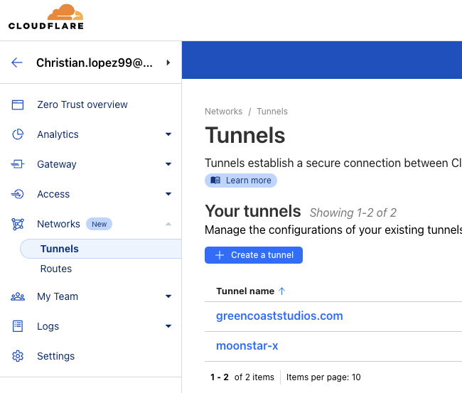
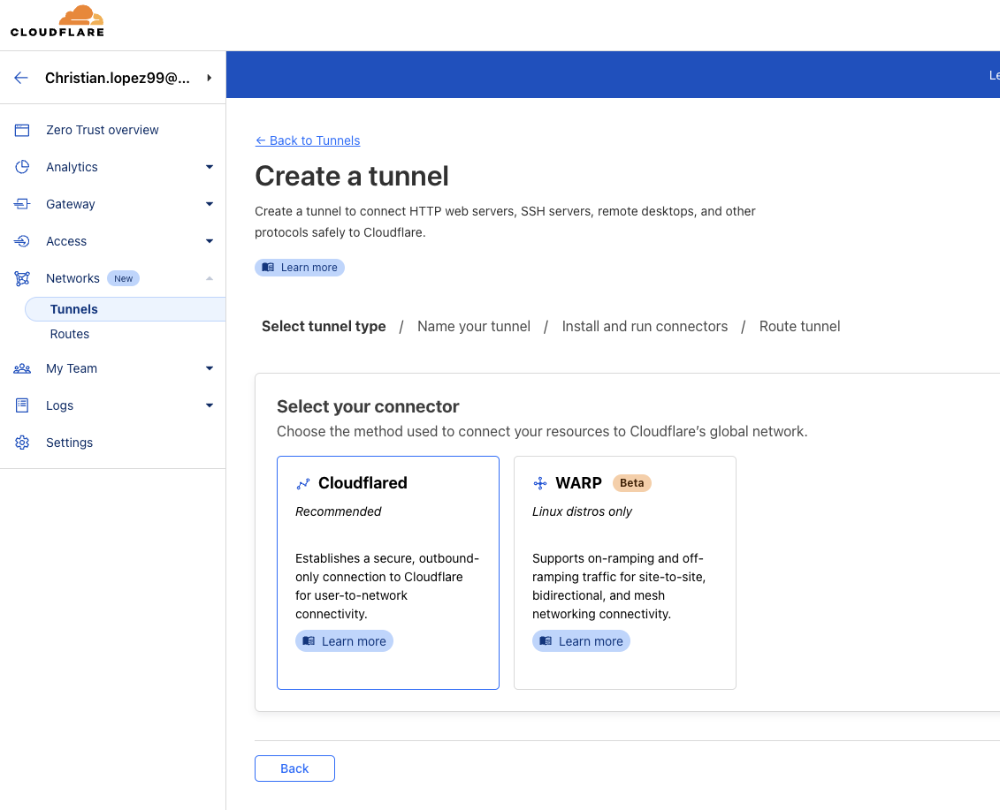
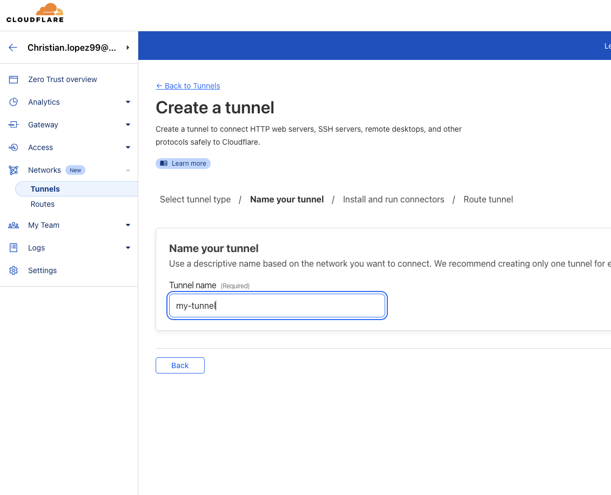
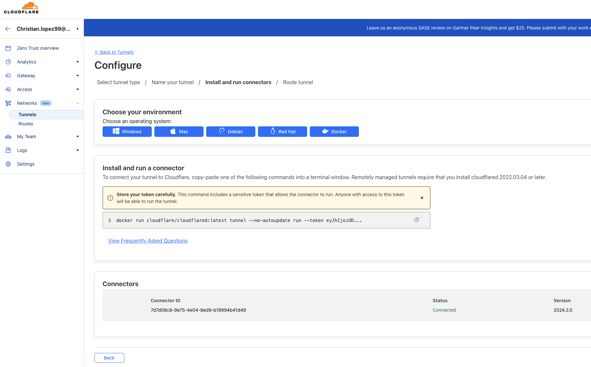
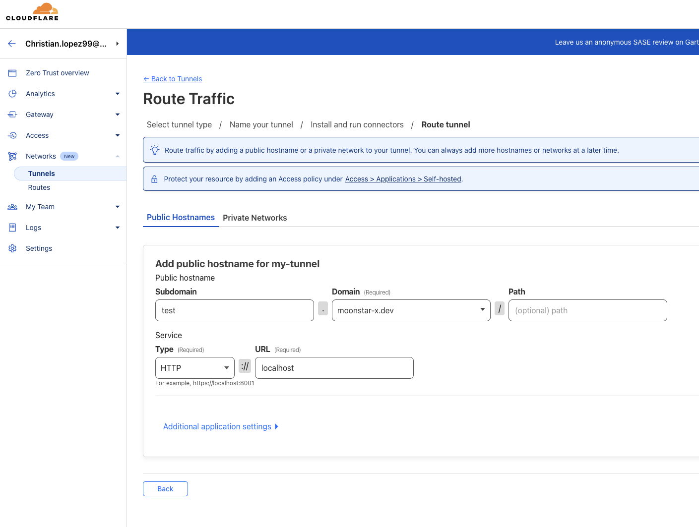
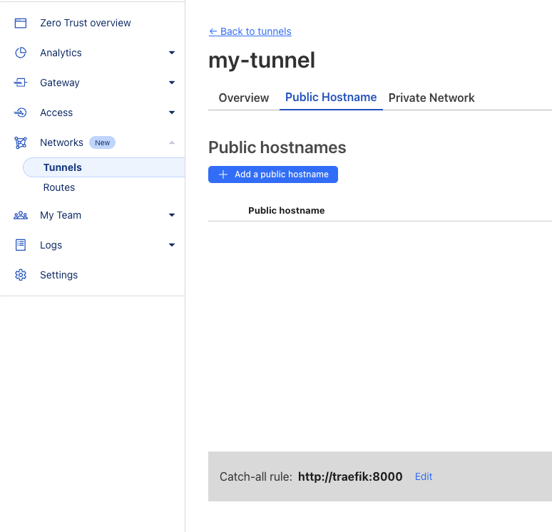
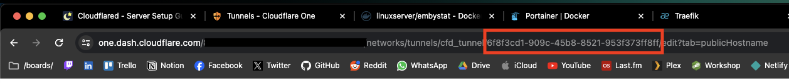

# Cloudflared

!!! warning
    You should set up [Traefik](./traefik.md) first before setting this up.

[Cloudflared](https://github.com/cloudflare/cloudflared) is a tunnel client that allows you to expose services in your network through a secure tunnel with Cloudflare.

There is an official image for this service that we'll use: [cloudflare/cloudflared](https://hub.docker.com/r/cloudflare/cloudflared).

!!! note
    In order to use this service you need to have an active domain registered and configured to use Cloudflare as it's DNS zone manager.

## Pre-Installation

We'll create a folder in the main user's home where all the service's data will be saved.

```bash
mkdir ~/services/networking/cloudflared
```

### External Network

Since this service needs to interoperate with another one, we'll need to have them inside the same network. Make sure to have created the `tunnel_external` network before defining the `docker-compose.yml` file. If you haven't created this network, you can do so with:

```bash
docker network create tunnel_external
```

## Creating a Tunnel

Before you can start the tunnel client, you need to acquire a token that will authenticate you to Cloudflare.

First, visit the following page: [https://one.dash.cloudflare.com](https://one.dash.cloudflare.com/) and log in to your account.

In the dashboard, click `Networks > Tunnels` and click the `Create a tunnel` button.



Select `Cloudflared` and click `Next`.



Name your tunnel and click in `Save tunnel`.



Select `Docker` as the environment and copy the command shown below. You'll notice this command shows a token inside, you should copy this value and continue by running your [Docker Compose](#docker-compose) stack with this value set as the container's `TUNNEL_TOKEN` environment variable.

You should notice that when doing this, the webpage will update with the detected connector. If you see this, it means that your container
is working perfectly. Finally click `Next`.



Next, create a temporary route. Cloudflare requires you to create one when creating the tunnel, however we'll remove it afterwards because we do not need it for now.

You can leave the subdomain as anything you want (just keep in mind that Cloudflare will automatically create a record with that subdomain name, so if you have another record with that name it may get replaced).

Choose your domain to use, and leave the path empty. As the service you should choose `HTTP` as the type and set the `URL` to anything.

Finally click `Save tunnel`.



You'll then be taken back to the tunnel dashboard. Select your newly created tunnel and click on the `Configure` button. You'll then see a tab
that says `Public Hostname`, click on it and you'll now see a list of your hostnames defined.

Delete all your hostnames and set the `Catch-all rule` to `http://traefik:8000`.

Your hostname definition should look like this:



Now, check your URL, you should see something along the lines of `/networks/tunnels/cfd_tunnel/:UUID` as shown in the following image:



Copy this uuid and paste it somewhere in the following way:

```text
UUID.cfargotunnel.com
```

So if your UUID is `abcd-efgh-ijkl` you should have the following text ready:

```text
abcd-efgh-ijkl.cfargotunnel.com
```

Head over to your domain's [DNS Dashboard](https://dash.cloudflare.com/) and create a new rule with the following info:

```text
Type: CNAME
Name: *
Target: abcd-efgh-ijkl.cfargotunnel.com
Proxied: Enabled
TTL: Auto
```

And done, you should now have a wildcard definition for your domain that will point to your [Traefik](./traefik.md) reverse proxy.

## Docker Compose

*Cloudflared* will be run using *Docker Compose*. The content of the `docker-compose.yml` file is as follows:

```yaml
services:
  tunnel:
    image: cloudflare/cloudflared:latest
    restart: unless-stopped
    networks:
      - default
      - tunnel_external
    command: tunnel run
    environment:
      TZ: America/Guayaquil
      TUNNEL_TOKEN: TUNNEL_TOKEN_HERE

networks:
  tunnel_external:
    external: true
```

!!! note
    Make sure to change `TUNNEL_TOKEN_HERE` to your actual tunnel token acquired from Cloudflare.

## Running

Start up the service with:

```bash
docker compose up -d
```

That's it! The service will auto-start on system startup and restart on failure.
